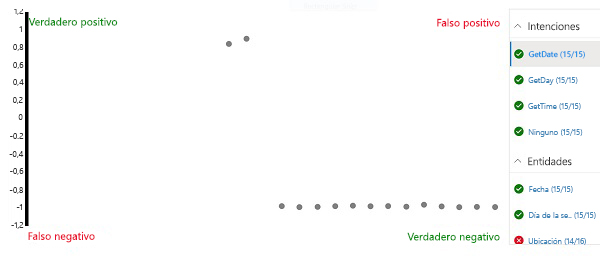

---
lab:
  title: Creación de una aplicación de Language Understanding
  module: Module 5 - Creating Language Understanding Solutions
ms.openlocfilehash: d8a32a2b6404e81d8a5d69cef874fad209de1bfc
ms.sourcegitcommit: d6da3bcb25d1cff0edacd759e75b7608a4694f03
ms.translationtype: HT
ms.contentlocale: es-ES
ms.lasthandoff: 11/16/2021
ms.locfileid: "132625985"
---
# <a name="create-a-language-understanding-app"></a>Creación de una aplicación de Language Understanding

El servicio Language Understanding permite definir una aplicación que encapsula un modelo de lenguaje que las aplicaciones pueden usar para interpretar la entrada de lenguaje natural de los usuarios, predecir la *intención* de los usuarios (lo que quieren lograr) e identificar las *entidades* a las que se debe aplicar la intención.

Por ejemplo, es posible que se espere que una aplicación de reconocimiento del lenguaje para una aplicación de reloj procese la entrada como:

*¿Qué hora es en Londres?*

Este tipo de entrada es un ejemplo de una *expresión* (algo que un usuario podría decir o escribir), para la que la *intención* deseada es obtener la hora en una ubicación específica (una *entidad*); en este caso, Londres.

> **Nota:** La tarea de la aplicación de reconocimiento del lenguaje es predecir la intención del usuario e identificar las entidades a las que se aplica la intención. <u>No</u> es tarea suya ejecutar realmente las acciones necesarias para satisfacer la intención. Por ejemplo, la aplicación de reloj puede usar una aplicación de lenguaje para distinguir que el usuario quiere saber la hora en Londres. No obstante, la propia aplicación cliente debe implementar la lógica para determinar la hora correcta y mostrarla al usuario.

## <a name="clone-the-repository-for-this-course"></a>Clonación del repositorio para este curso

Si aún no ha clonado el repositorio de código **AI-102-AIEngineer** en el entorno en el que está trabajando en este laboratorio, siga estos pasos para hacerlo. De lo contrario, abra la carpeta clonada en Visual Studio Code.

1. Inicie Visual Studio Code.
2. Abra la paleta (Mayús + Ctrl + P) y ejecute un comando **Git: Clone** para clonar el repositorio `https://github.com/MicrosoftLearning/AI-102-AIEngineer` en una carpeta local (no importa qué carpeta).
3. Cuando se haya clonado el repositorio, abra la carpeta en Visual Studio Code.
4. Espere mientras se instalan archivos adicionales para admitir los proyectos de código de C# en el repositorio.

    > **Nota**: Si se le pide que agregue los recursos necesarios para compilar y depurar, seleccione **Ahora no**.

## <a name="create-language-understanding-resources"></a>Creación de los recursos de Language Understanding

Para usar el servicio Language Understanding, necesitará dos tipos de recursos:

- Un recurso de *creación*: usado para definir, entrenar y probar el modelo de reconocimiento del lenguaje. Este debe ser un recurso **Language Understanding - Authoring** en su suscripción de Azure.
- Un recurso de *predicción*: usado para publicar la aplicación de reconocimiento del lenguaje y controlar las solicitudes de las aplicaciones de cliente que la usan. Este puede ser un recurso de **Language Understanding** o de **Cognitive Services** en su suscripción de Azure.

     > **Importante**: Los recursos de creación se deben crear en una de las tres *regiones* (Europa, Australia o EE. UU.). Las aplicaciones de reconocimiento del lenguaje creadas en recursos de creación de Europa o Australia solo se pueden implementar en recursos de predicción de cada una de estas regiones, respectivamente. Los modelos creados en recursos de creación de EE. UU. se pueden implementar en recursos de predicción en cualquier ubicación de Azure que no sea Europa ni Australia. Consulte la [documentación sobre regiones de creación y publicación](https://docs.microsoft.com/azure/cognitive-services/luis/luis-reference-regions) para obtener detalles sobre cómo seleccionar las ubicaciones de creación y predicción.

Si aún no tiene recursos de creación y predicción de Language Understanding:

1. Inicie sesión en Azure Portal en `https://portal.azure.com` y regístrese con la cuenta de Microsoft asociada a su suscripción de Azure.
2. Seleccione el botón **&amp;#65291;Crear un recurso**, busque *reconocimiento del lenguaje* y cree un recurso de **Language Understanding** con la siguiente configuración.

    *Asegúrese de seleccionar **Language Understanding**, <u>no</u> Language Understanding (Azure Cognitive Services)* .

    - **Create option** (Opción de creación): ambos
    - **Suscripción**: *suscripción de Azure*
    - **Grupo de recursos**: *elija o cree un grupo de recursos (si usa una suscripción restringida, es posible que no tenga permiso para crear un nuevo grupo de recursos; use el proporcionado)*
    - **Nombre**: *escriba un nombre único*
    - **Ubicación de creación**: *seleccione su ubicación preferida*
    - **Plan de tarifa de creación**: F0
    - **Ubicación de predicción**: *misma ubicación que la de creación*
    - **Plan de tarifa de predicción**: F0
3. Espere a que se creen los recursos y observe que se aprovisionan dos recursos de Language Understanding, uno para la creación y otro para la predicción. Puede ver ambos navegando hasta el grupo de recursos donde los creó. Si selecciona **Ir al recurso**, se abrirá el recurso de *creación*.

## <a name="create-a-language-understanding-app"></a>Creación de una aplicación de Language Understanding

Ahora que ha creado un recurso de creación, puede usarlo para crear una aplicación de Language Understanding.

1. En una nueva pestaña del explorador, abra el portal de Language Understanding en `https://www.luis.ai`.
2. Inicie sesión con la cuenta de Microsoft asociada a su suscripción de Azure. Si es la primera vez que ha iniciado sesión en el portal de Language Understanding, es posible que tenga que conceder a la aplicación algunos permisos para acceder a los detalles de la cuenta. A continuación, complete los pasos de *bienvenida* seleccionando la suscripción de Azure y el recurso de creación que acaba de crear.

    > **Nota**: Si su cuenta está asociada a varias suscripciones en directorios diferentes, es posible que tenga que cambiar al directorio que contiene la suscripción en la que aprovisionó los recursos de Language Understanding.

3. En la página **Conversation Apps**, asegúrese de que su suscripción y el recurso de creación de Language Understanding estén seleccionados. Después, cree una nueva aplicación de conversación con la siguiente configuración:
    - **Nombre**: Clock
    - **Referencia cultural**: English (*si esta opción no está disponible, déjela en blanco*)
    - **Descripción**: reloj en lenguaje natural
    - **Recurso de predicción**: *recurso de predicción de Language Understanding*

    Si la aplicación **Clock** no se abre automáticamente, ábrala.
    
    Si aparece un panel con consejos para crear una aplicación eficaz de Language Understanding, ciérrelo.

## <a name="create-intents"></a>Crear intenciones

Lo primero que haremos en la nueva aplicación es definir algunas intenciones.

1. En la página **Intenciones**, seleccione **&#65291; Crear** para crear una intención denominada **GetTime**.
2. En la intención **GetTime**, agregue las siguientes expresiones como entrada de usuario de ejemplo:

    *What is the time?* (¿Qué hora es?)

    *What time is it?* (¿Qué hora es?)

3. Después de agregar estas expresiones, vuelva a la página **Intenciones** y agregue otra nueva intención denominada **GetDay** con las siguientes expresiones:

    *What is the day today?* ¿Qué día es hoy?

    *What day is it?* ¿Qué día es?

4. Después de agregar estas expresiones, vuelva a la página **Intenciones** agregue otra nueva intención denominada **GetDate** con las siguientes expresiones:

    *What is the date today?* ¿Qué fecha es hoy?

    *What date is it?* ¿Qué fecha es?

5. Después de agregar estas expresiones, vuelva a la página **Intenciones** y seleccione la intención **None** (Ninguna). Se proporciona como reserva para la entrada que no se asigna a ninguna de las intenciones que ha definido en el modelo de lenguaje.
6. Agregue las siguientes expresiones a la intención **None** (Ninguna):

    *hello*

    *goodbye*

## <a name="train-and-test-the-app"></a>Formación y prueba de la aplicación

Ahora que ha agregado algunas intenciones, vamos a entrenar la aplicación y a ver si puede predecirlas correctamente a partir de la entrada del usuario.

1. En la parte superior derecha del portal, seleccione **Entrenar** para entrenar la aplicación.
2. Al entrenar la aplicación, seleccione **Probar** para mostrar el panel Prueba y, a continuación, escriba la siguiente expresión de prueba:

    *What's the time now?* (¿Qué hora es?)

    Revise el resultado que se devuelve y observe que incluye la intención pronosticada (que debe ser **GetTime**) y una puntuación de confianza que indica la probabilidad que el modelo calculó para la dicha intención.

3. Pruebe la siguiente expresión de prueba:

    *Tell me the time* (Dime qué hora es)

    De nuevo, revise la intención pronosticada y la puntuación de confianza.

4. Pruebe la siguiente expresión de prueba:

    *What's today?* ¿Qué es hoy?

    Esperamos que el modelo prediga la intención **GetDay**.

5. Por último, pruebe esta expresión de prueba:

    *Hi* (Hola)

    Debería devolver la intención **None** (Ninguna).

6. Cierre el panel Prueba.

## <a name="add-entities"></a>Agregar entidades

Hasta ahora ha definido algunas expresiones simples que se asignan a intenciones. La mayoría de las aplicaciones reales incluyen expresiones más complejas de las que se deben extraer entidades de datos específicas para obtener más contexto para la intención.

### <a name="add-a-machine-learned-entity"></a>Agregar una entidad de *aprendizaje automático*

El tipo más común de entidad es una entidad de *aprendizaje automático*, en la que la aplicación aprende a identificar valores de entidad basados en ejemplos.

1. En la página **Entidades**, seleccione **&#65291; Crear** para crear una entidad.
2. En el cuadro de diálogo **Crear una entidad**, cree una entidad de **aprendizaje automático** denominada **Location**.
3. Una vez creada la entidad **Location**, vuelva a la página **Intenciones** y seleccione la intención **GetTime**.
4. Escriba la siguiente expresión de ejemplo nueva:

    *What time is it in London?* (¿Qué hora es en Londres?)

5. Cuando se haya agregado la expresión, seleccione la palabra ***london** _ y, en la lista desplegable que aparece, seleccione _ *Location** para indicar que "london" es un ejemplo de ubicación.
6. Agregue otra expresión de ejemplo:

    *What is the current time in New York?* ¿Cuál es la hora actual en Nueva York?

7. Cuando se haya agregado la expresión, seleccione las palabras ***new york** _ y asígnelas a la entidad _ *Location**.

### <a name="add-a-list-entity"></a>Agregar una entidad *list*

En algunos casos, los valores válidos para una entidad se pueden restringir a una lista de términos y sinónimos específicos, que pueden ayudar a la aplicación a identificar instancias de la entidad en expresiones.

1. En la página **Entidades**, seleccione **&#65291; Crear** para crear una entidad.
2. En el cuadro de diálogo **Crear una entidad**, cree una entidad **List** denominada **Weekday**.
3. Agregue los siguientes **valores normalizados** y **sinónimos** :

    | Valores normalizados | Sinónimos|
    |-------------------|---------|
    | sunday | sun |
    | monday | mon |
    | tuesday | tue |
    | wednesday | wed |
    | thursday | thu |
    | friday | fri |
    | saturday | sat |

3. Una vez creada la entidad **Weekday**, vuelva a la página **Intenciones** y seleccione la intención **GetDate**.
4. Escriba la siguiente expresión de ejemplo nueva:

    *What date was it on Saturday?* (¿Qué fecha era el sábado?)

5. Cuando se haya agregado la expresión, compruebe que **saturday** se ha asignado automáticamente a la entidad **Weekday**. Si no es así, seleccione la palabra **_saturday_ *_ y, en la lista desplegable que aparece, seleccione _* Weekday**.
6. Agregue otra expresión de ejemplo:

    *What date will it be on Friday?* (¿Qué fecha será el viernes?)

7. Cuando se haya agregado la expresión, asegúrese de que **friday** se ha asignado a la entidad **Weekday**.

### <a name="add-a-regex-entity"></a>Agregar una entidad *Regex*

A veces, las entidades tienen un formato específico, como un número de serie, un código de formulario o una fecha. Puede definir una expresión regular (*regex*) que describa un formato esperado para ayudar a la aplicación a identificar los valores de entidad correspondientes.

1. En la página **Entidades**, seleccione **&#65291; Crear** para crear una entidad.
2. En el cuadro de diálogo **Crear una entidad**, cree una entidad **Regex** denominada **Date** con la expresión regular siguiente:

    ```
    [0-9]{2}/[0-9]{2}/[0-9]{4}
    ```

    > **Nota**: Se trata de una expresión regular simple que comprueba si hay dos dígitos seguidos de "/", otros dos dígitos, otro carácter "/" y cuatro dígitos; por ejemplo, *11/01/2020*. Permite fechas no válidas, como *56/00/9999*, pero es importante recordar que la expresión regular de entidad se usa para identificar la entrada de datos que está *pensada* como una fecha, no para validar los valores de fecha.

3. Una vez creada la entidad **Date**, vuelva a la página **Intenciones** y seleccione la intención **GetDay**.
4. Escriba la siguiente expresión de ejemplo nueva:

    *What day was 01/01/1901?* (¿En que cayó el 01/01/1901?)

5. Cuando se haya agregado la expresión, compruebe que **01/01/1901** se ha asignado automáticamente a la entidad **Date**. Si no es así, seleccione **_01/01/1901_ *_ y, en la lista desplegable que aparece, seleccione _* Date**.
6. Agregue otra expresión de ejemplo:

    *¿Qué día será el 12/12/2099?*

7. Cuando se haya agregado la expresión, asegúrese de que **12/12/2099** está asignado a la entidad **Date**.

### <a name="retrain-the-app"></a>Vuelva a entrenar la aplicación.

Ahora que ha modificado el modelo de lenguaje, debe volver a entrenar y probar la aplicación.

1. En la parte superior derecha del portal, seleccione **Entrenar** para volver a entrenar la aplicación.
2. Al entrenar la aplicación, seleccione **Probar** para mostrar el panel Prueba y, a continuación, escriba la siguiente expresión de prueba:

    *¿Qué hora es en Edimburgo?*

3. Revise el resultado que se devuelve, que debería predecir la intención **GetTime**. A continuación, seleccione **Inspeccionar** y, en el panel de inspección adicional que se muestra, examine la sección **No hay entidades**. El modelo debe haber pronosticado que "edimburgo" es una instancia de una entidad **Location**.
4. Pruebe las siguientes expresiones:

    *¿Qué fecha es el viernes?*

    *¿Qué fecha es el jueves?*

    *¿Cuál día era el 01/01/2020?*

5. Cuando haya terminado de realizar las pruebas, cierre el panel de inspección, pero deje abierto el panel de pruebas.

## <a name="perform-batch-testing"></a>Realización de pruebas por lotes

Puede usar el panel de pruebas para probar expresiones individuales de forma interactiva, pero para los modelos de lenguaje más complejos suele ser más eficaz realizar *pruebas por lotes*.

1. En Visual Studio Code, abra el archivo **batch-test.json** en la carpeta **09-luis-app**. Este archivo consta de un documento JSON que contiene varios casos de prueba para el modelo de lenguaje de reloj que ha creado.
2. En el portal de Language Understanding, en el panel Prueba, seleccione **Panel de prueba por lotes**. A continuación, seleccione **&#65291; Importar** e importe el archivo **batch-test.json** y asígnele el nombre **clock-test**.
3. En el panel Procesamiento de pruebas por lotes, ejecute la prueba **clock-test**.
4. Cuando se haya completado la prueba, seleccione **Ver resultados**.
5. En la página de resultados, vea la matriz de confusión que representa los resultados de la predicción. Muestra las predicciones de verdaderos positivos, falsos positivos, verdaderos negativos y falsos negativos para la intención o la entidad seleccionada en la lista de la derecha.

    

    > **Nota**: Cada expresión se puntúa como *positiva* o *negativa* para cada intención; así, por ejemplo, la expresión "¿Qué hora es?" debería puntuarse como *positiva* para la intención **GetTime** y como *negativa* para la intención **GetDate**. Los puntos de la matriz de confusión muestran qué expresiones se predijeron correctamente (*true*) e incorrectamente *(false)* como *positivas* y *negativas* para la intención seleccionada.

6. Con la intención **GetDate** seleccionada, elija cualquiera de los puntos de la matriz de confusión para ver los detalles de la predicción, incluida la expresión y la puntuación de confianza para la predicción. A continuación, seleccione las intenciones **GetDay**, **GetTime** y **Ninguna** y vea sus resultados de predicción. La aplicación debería haber realizado bien la predicción de las intenciones.

    > **Nota**: Es posible que la interfaz de usuario no borre los puntos seleccionados previamente.

7. Seleccione la entidad **Location** y vea los resultados de la predicción en la matriz de confusión. En concreto, tenga en cuenta las predicciones que eran *falsos negativos*: se trata de casos en los que la aplicación no pudo detectar la ubicación especificada en la expresión, lo que indica que puede que deba agregar más expresiones de ejemplo a las intenciones y volver a entrenar el modelo.
8. Cierre el panel Procesamiento de pruebas por lotes.

## <a name="publish-the-app"></a>Publicación de la aplicación

En un proyecto real, refinaría de forma iterativa las intenciones y las entidades, y volvería a entrenar y a probar la aplicación hasta que estuviera satisfecho con el rendimiento predictivo. A continuación, puede publicar la aplicación para que la usen las aplicaciones cliente.

1. En la parte superior derecha del portal de Language Understanding, seleccione **Publicar**.
2. Seleccione **Espacio de producción** y publique la aplicación.
3. Una vez completada la publicación, en la parte superior del portal de Language Understanding, seleccione **Administrar**.
4. En la página **Configuración**, anote el **identificador de aplicación**. Las aplicaciones cliente lo necesitan para usar la aplicación.
5. En la página **Recursos de Azure**, anote la **clave principal**, la **clave secundaria** y la **dirección URL del punto de conexión** para el recurso de predicción a través del cual se puede consumir la aplicación. Las aplicaciones cliente necesitan el punto de conexión y una de las claves para conectarse al recurso de predicción y autenticarse.
6. En Visual Studio Code, en la carpeta **09-luis-app**. seleccione el archivo por lotes **GetIntent.cmd** y vea el código que contiene. Este script de línea de comandos usa cURL para llamar a la API de REST de Language Understanding para la aplicación y el punto de conexión de predicción especificados.
7. Reemplace los valores de marcador de posición del script por el **Identificador de aplicación**, la **dirección URL del punto de conexión** y la **clave principal** o la **clave secundaria** de la aplicación Language Understanding; a continuación, guarde el archivo actualizado.
8. Haga clic con el botón derecho en la carpeta **09-luis-app** y abra un terminal integrado. A continuación, escriba el siguiente comando (asegúrese de incluir las comillas):

    ```
    GetIntent "What's the time?"
    ```

9. Revise la respuesta JSON devuelta por la aplicación, que debería indicar la intención de puntuación superior pronosticada para la entrada (que debería ser **GetTime**).
10. Pruebe el siguiente comando:

    ```
    GetIntent "What's today's date?"
    ```

11. Examine la respuesta y compruebe que predice la intención **GetDate**.
12. Pruebe el siguiente comando:

    ```
    GetIntent "What time is it in Sydney?"
    ```

13. Examine la respuesta y compruebe que incluye una entidad **Location**.

14. Pruebe los siguientes comandos y examine las respuestas:

    ```
    GetIntent "What time is it in Glasgow?"
    ```

    ```
    GetIntent "What's the time in Nairobi?"
    ```

    ```
    GetIntent "What's the UK time?"
    ```
15. Pruebe algunas variaciones más: el objetivo es generar al menos algunas respuestas que predigan correctamente la intención **GetTime**, pero no detecten correctamente una entidad **Location**.

    Mantenga abierto el terminal. Volveremos a él más tarde.

## <a name="apply-active-learning"></a>Aplicar el *aprendizaje activo*

Puede mejorar una aplicación Language Understanding en función de expresiones históricas enviadas al punto de conexión. Esta práctica se denomina *aprendizaje activo*.

En el procedimiento anterior, usó cURL para enviar solicitudes al punto de conexión de la aplicación. Estas solicitudes incluían la opción de registrar las consultas, lo que permite a la aplicación realizar un seguimiento de estas para su uso en el aprendizaje activo.

1. En el portal de Language Understanding, seleccione **Compilar** y consulte la página **Revisar expresiones de punto de conexión**. En esta página se enumeran las expresiones registradas que el servicio ha marcado para su revisión.
2. Para las expresiones para las que la intención y una nueva entidad de ubicación (que no se incluyeron en las expresiones de entrenamiento originales) se predijeron correctamente, seleccione **&#10003;** para confirmar la entidad y, a continuación, use el icono **&#10514;** para agregar la expresión a la intención como un ejemplo de entrenamiento.
3. Busque un ejemplo de una expresión en la que la intención **GetTime** se haya identificado correctamente, pero  **no** se haya identificado una entidad <u>Location</u>. Seleccione el nombre de la ubicación y asígnelo a la entidad **location**. Después, use el icono **&#10514;** para agregar la expresión a la intención como un ejemplo de entrenamiento.
4. Vaya a la página **Intenciones** y abra la intención **GetTime** para confirmar que se han agregado las expresiones sugeridas.
5. En la parte superior del portal de Language Understanding, seleccione **Entrenar** para volver a entrenar la aplicación.
6. En la parte superior derecha del portal de Language Understanding, seleccione **Publicar** y vuelva a publicar la aplicación en el **Espacio de producción**.
7. Vuelva al terminal de la carpeta **09-luis-app** y use el comando **GetIntent** para enviar la expresión que agregó y corrigió durante el aprendizaje activo.
8. Compruebe que el resultado ahora incluye la entidad **Location**. A continuación, pruebe otra expresión que use la misma expresión, pero especifique una ubicación diferente (por ejemplo, *Berlin*).

## <a name="export-the-app"></a>Exportar la aplicación

Puede usar el portal de Language Understanding para desarrollar y probar la aplicación de lenguaje, pero en un proceso de desarrollo de software para DevOps debe mantener una definición controlada por el origen de la aplicación que se pueda incluir en las canalizaciones de integración y entrega continuas (CI/CD). Aunque *puede* usar el SDK o la API de REST de Language Understanding en scripts de código para crear y entrenar la aplicación, una manera más sencilla es usar el portal para crear la aplicación y exportarla como un archivo *.lu* que se pueda importar y volver a entrenar en otra instancia de Language Understanding. Este enfoque le permite usar las ventajas de productividad del portal, al tiempo que mantiene la portabilidad y reproducibilidad de la aplicación.

1. En el portal de Language Understanding, seleccione **Administrar**.
2. En la página **Versiones**, seleccione la versión actual de la aplicación (solo debe haber una).
3. En la lista desplegable **Exportar**, seleccione **Exportar como LU**. A continuación, cuando el explorador lo solicite, guarde el archivo en la carpeta **09-luis-app**.
4. En Visual Studio Code, abra el archivo **.lu** que acaba de exportar y descargar (si se le pide que busque en Marketplace una extensión que pueda leerlo, descarte el mensaje). Tenga en cuenta que el formato LU es legible, lo que lo convierte en un método eficaz para documentar la definición de la aplicación Language Understanding en un entorno de desarrollo en equipo.

## <a name="more-information"></a>Más información

Para obtener más información sobre el uso del servicio **Language Understanding**, consulte la [documentación de Language Understanding](https://docs.microsoft.com/azure/cognitive-services/luis/).
