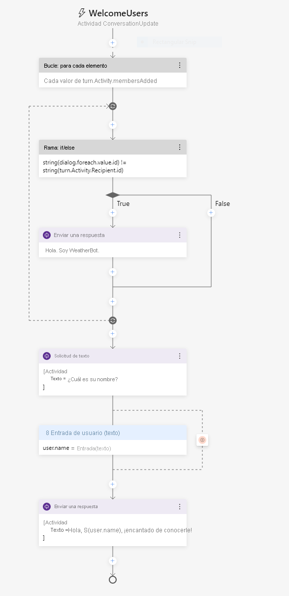

---
lab:
  title: Creación de un bot con Bot Framework Composer
  module: Module 7 - Conversational AI and the Azure Bot Service
ms.openlocfilehash: f25609df8d9abc29e691bd83d0470561c9e3e4b0
ms.sourcegitcommit: b934aa694b86756d8b297a384cc6b707f0536e57
ms.translationtype: HT
ms.contentlocale: es-ES
ms.lasthandoff: 12/08/2021
ms.locfileid: "134300688"
---
# <a name="create-a-bot-with-bot-framework-composer"></a>Creación de un bot con Bot Framework Composer

Bot Framework Composer es un diseñador gráfico que permite crear de forma rápida y sencilla bots de conversación sofisticados sin necesidad de escribir código. Composer es una herramienta de código abierto que presenta un lienzo visual para crear bots.

## <a name="prepare-to-develop-a-bot"></a>Preparación para el desarrollo de un bot

Empecemos por preparar los servicios y las herramientas que necesita para desarrollar un bot.

### <a name="get-an-openweather-api-key"></a>Obtención de una clave de la API OpenWeather

En este ejercicio, creará un bot que usa el servicio OpenWeather para recuperar las condiciones meteorológicas de la ciudad especificada por el usuario. Necesitará una clave de API para que el servicio funcione.

1. En un explorador web, vaya al sitio de OpenWeather en `https://openweathermap.org/price`.
2. Solicite una clave de API gratuita y cree una cuenta de OpenWeather (si aún no la tiene).
3. Después de registrarse, consulte la página **Claves de API** para ver la clave de API.

### <a name="update-bot-framework-composer"></a>Actualización de Bot Framework Composer

Va a usar Bot Framework Composer para crear el bot. Esta herramienta se actualiza periódicamente, así que vamos a asegurarnos de que tiene instalada la última versión.

> **Nota**: Las actualizaciones pueden incluir cambios en la interfaz de usuario que afecten a las instrucciones de este ejercicio.

1. Inicie **Bot Framework Composer** y, si no se le solicita automáticamente que instale una actualización, use la opción **Buscar actualizaciones** del menú **Ayuda** para buscar actualizaciones.
2. Si hay una actualización disponible, elija la opción para instalarla cuando la aplicación esté cerrada. A continuación, cierre Bot Framework Composer e instale la actualización para el usuario que tiene la sesión iniciada actualmente; para ello, reinicie Bot Framework Composer una vez completada la instalación. La instalación puede tardar unos minutos.
3. Asegúrese de que la versión de Bot Framework Composer es **2.0.0** o posterior.

## <a name="create-a-bot"></a>Creación de un bot

Ya está listo para usar Bot Framework Composer a fin de crear un bot.

### <a name="create-a-bot-and-customize-the-welcome-dialog-flow"></a>Creación de un bot y personalización del flujo del cuadro de diálogo de "bienvenida"

1. Inicie Bot Framework Composer si aún no está abierto.
2. En la pestaña **Inicio**, seleccione **Nuevo**. A continuación, cree un nuevo bot vacío; asígnele el nombre **WeatherBot** y guárdelo en una carpeta local.
3. Cierre el panel **Introducción** si se abre y, a continuación, en el panel de navegación de la izquierda, seleccione **Saludo** para abrir el lienzo de creación y mostrar la actividad *ConversationUpdate* a la que se llama cuando un usuario se une inicialmente a una conversación con el bot. La actividad se compone de un flujo de acciones.
4. En el panel de propiedades de la derecha, edite el título de **Saludo**; para ello, seleccione la palabra **Saludo** en la parte superior del panel de propiedades de la derecha y cámbiela a **WelcomeUsers**.
5. En el lienzo de creación, seleccione la acción **Send a response** (Enviar una respuesta). A continuación, en el panel de propiedades, cambie el texto predeterminado de *Hi to your bot* (Hola al bot) a `Hi! I'm WeatherBot.`.
6. En el lienzo de creación, seleccione el símbolo **+** final (justo encima del círculo que marca el <u>final</u> del flujo de diálogo) y agregue una nueva acción **Formular una pregunta** para una respuesta de tipo **Texto**.

    La nueva acción crea dos nodos en el flujo de diálogo. El primer nodo define una solicitud para que el bot formule una pregunta al usuario y el segundo nodo representa la respuesta que se recibirá del usuario. En el panel de propiedades, estos nodos tienen las pestañas **Respuesta del bot** y **Entrada de usuario** correspondientes.

7. En el panel de propiedades, en la pestaña **Respuesta del bot**, agregue una respuesta con el texto `What's your name?`. Después, en la pestaña **Entrada de usuario**, establezca el valor de **Propiedad** en `user.name` para definir una variable a la que pueda acceder más adelante en la conversación con el bot.
8. De nuevo en el lienzo de creación, seleccione el símbolo **+** en la acción **User Input(Text)** (Entrada de usuario [texto]) que acaba de agregar y agregue la acción **Enviar una respuesta**.
9. Seleccione la acción **Enviar una respuesta** recién agregada y, en el panel de propiedades, establezca el valor de texto en `Hello ${user.name}, nice to meet you!`.

    Este es el aspecto que debería tener el flujo de la actividad completado:

    

### <a name="test-the-bot"></a>Probar el bot

Ya se ha completado el bot básico, así que vamos a probarlo.

1. Seleccione **Start Bot** (Iniciar bot) en la esquina superior derecha de Composer y espere mientras el bot se compila e inicia. Este proceso podría tardar varios minutos.

    - Si se muestra un mensaje del Firewall de Windows, habilite el acceso para todas las redes.

2. En el panel **Administrador del entorno de ejecución del bot local**, seleccione **Abrir Chat en web**.
3. En el panel del chat en web de **WeatherBot**, tras una breve pausa, verá el mensaje de bienvenida y la solicitud para escribir su nombre.  Escriba el nombre y presione **Entrar**.
4. El bot debe responder con el mensaje **Hello *your_name*, nice to meet you!** (Hola, your_name, encantado de conocerte).
5. Cierre el panel del chat en web.
6. En la parte superior derecha de Composer, junto a **&#8635; Restart bot** (Reiniciar bot), haga clic en **<u>=</u>** para abrir el panel **Administrador del entorno de ejecución del bot local** y use icono ⏹ para detener el bot.

## <a name="add-a-dialog-to-get-the-weather"></a>Incorporación de un diálogo para obtener información sobre el tiempo

Ahora que tiene un bot en funcionamiento, puede ampliar sus funcionalidades agregando diálogos para interacciones específicas. En este caso, agregará un diálogo que se desencadena cuando el usuario menciona "tiempo".

### <a name="add-a-dialog"></a>Incorporación de un diálogo

En primer lugar, debe definir un flujo de diálogo que se usará para controlar las preguntas sobre el tiempo.

1. En Composer, en el panel de navegación, mantenga el ratón sobre el nodo de nivel superior (**WeatherBot**) y, en el menú **...** , seleccione **+Add a dialog** (Agregar un diálogo), como se muestra aquí:

    

    A continuación, cree un nuevo diálogo denominado **GetWeather** con la descripción **Obtener la condición meteorológica actual correspondiente al código postal proporcionado**.
2. En el panel de navegación, seleccione el nodo **BeginDialog** para el nuevo diálogo **GetWeather**. Después, en el lienzo de creación, use el símbolo **+** para agregar una acción **Formular una pregunta** para una respuesta de tipo **Texto**.
3. En el panel de propiedades, en la pestaña **Respuesta del bot**, agregue la respuesta `Enter your city.`.
4. En la pestaña **Entrada de usuario**, establezca el valor del campo **Propiedad** en `dialog.city` y el del campo **Formato de salida** en la expresión `=trim(this.value)` para quitar los espacios superfluos que hay alrededor del valor proporcionado por el usuario.

    El flujo de la actividad hasta ahora debe ser similar al siguiente:

    

    Hasta ahora, el diálogo pide al usuario que escriba una ciudad. Ahora debe implementar la lógica para recuperar la información meteorológica de la ciudad especificada.

6. En el lienzo de creación, directamente en la acción **Entrada de usuario** para la entrada de ciudad, seleccione el símbolo **+** para agregar una nueva acción.
7. En la lista de acciones, seleccione **Access external resources** (Acceder a recursos externos) y luego **Enviar una solicitud HTTP**.
8. Establezca las propiedades de **Solicitud HTTP** como se indica a continuación y reemplace el valor de **YOUR_API_KEY** por la clave de la API [OpenWeather](https://openweathermap.org/price):
    - **Método HTTP**: GET
    - **Dirección URL**: `http://api.openweathermap.org/data/2.5/weather?units=metric&q=${dialog.city}&appid=YOUR_API_KEY`
    - **Propiedad del resultado**: `dialog.api_response`

    El resultado puede incluir cualquiera de las cuatro propiedades siguientes de la respuesta HTTP:

    - **statusCode**. Se accede a ella a través de **dialog.api_response.statusCode**.
    - **reasonPhrase**. Se accede a ella a través de **dialog.api_response.reasonPhrase**.
    - **content**. Se accede a ella a través de **dialog.api_response.content**.
    - **headers**. Se accede a ella a través de **dialog.api_response.headers**.

    Además, si el tipo de respuesta es JSON, será un objeto deserializado disponible a través de la propiedad **dialog.api_response.content**. Para obtener información detallada sobre la API OpenWeather y la respuesta que devuelve, consulte la [documentación de la API OpenWeather](https://openweathermap.org/current).

    Ahora debe agregar lógica al flujo del diálogo que controla la respuesta, lo que puede indicar que la solicitud HTTP se ha realizado correctamente o no.

9. En el lienzo de creación, en la acción **Enviar solicitud HTTP** que ha creado, agregue una acción **Create a condition (Crear una condición)**  > **Crear una rama: if/else**. Esta acción define una rama en el flujo del diálogo con las rutas **True** y **False**.
10. En las **propiedades** de la acción de rama, establezca el campo **Condición** para escribir la siguiente expresión:

    ```
    =dialog.api_response.statusCode == 200
    ```

11. Si la llamada se realizó correctamente, debe almacenar la respuesta en una variable. En el lienzo creación, en la rama **True**, agregue una acción **Administrar propiedades** > **Establecer propiedades**. A continuación, en el panel de propiedades, agregue las siguientes asignaciones de propiedades:

    | Propiedad | Value |
    | -- | -- |
    | `dialog.weather` | `=dialog.api_response.content.weather[0].description` |
    | `dialog.temp` | `=round(dialog.api_response.content.main.temp)` |
    | `dialog.icon` | `=dialog.api_response.content.weather[0].icon` |

12. Todavía en la rama **True**, agregue una acción **Enviar una respuesta** en la acción **Set a property** (Establecer una propiedad) y establezca su texto en:

    ```
    The weather in ${dialog.city} is ${dialog.weather} and the temperature is ${dialog.temp}&deg;.
    ```

    ***Nota**: Este mensaje usa las propiedades **dialog.city**, **dialog.weather** y **dialog.temp** que estableció en las acciones anteriores. Más adelante, también usará la propiedad **dialog.icon**.*

13. También debe tener en cuenta una respuesta del servicio meteorológico que no es 200, por lo que en la rama **False**, agregue una acción **Enviar una respuesta** y establezca su texto en `I got an error: ${dialog.api_response.content.message}.`.

    El flujo de diálogo ahora debe tener el siguiente aspecto:

    

### <a name="add-a-trigger-for-the-dialog"></a>Incorporación de un desencadenador para el diálogo

Ahora necesita alguna forma para que el nuevo diálogo se inicie desde el diálogo de bienvenida existente.

1. En el panel de navegación, seleccione el diálogo **WeatherBot** que contiene **WelcomeUsers** (se encuentra en el nodo de bot de nivel superior del mismo nombre).

    

2. En el panel de propiedades del diálogo **WeatherBot** seleccionado, en la sección de **reconocimiento del lenguaje**, establezca **Recognizer type** (Tipo de reconocedor) en **Regular expression recognizer** (Reconocedor de expresiones regulares).

    > El tipo de reconocedor predeterminado usa el servicio Language Understanding para producir la intención del usuario mediante un modelo de reconocimiento del lenguaje natural. Se usa un reconocedor de expresiones regulares para simplificar este ejercicio. En una aplicación real, debe considerar la posibilidad de usar Language Understanding para permitir un reconocimiento de intenciones más sofisticado.

3. En el menú **...** del diálogo **WeatherBot**, seleccione **Agregar nuevo desencadenador**.

    

    Después, cree un desencadenar con la siguiente configuración:

    - **What is the type of this trigger?** (¿Cuál es el tipo de este desencadenador?): Intent recognized (Intención reconocida)
    - **What is the name of this trigger (RegEx)** (¿Cuál es el nombre de este desencadenador [regex]?): `WeatherRequested`
    - **Please input regex pattern** (Escriba el patrón regex): `weather`

    > El texto escrito en el cuadro de texto del patrón regex es un patrón de expresión regular sencillo que hará que el bot busque la palabra *weather* (tiempo) en cualquier mensaje entrante.  Si la palabra "weather" está presente, el mensaje se convierte en una **intención reconocida** y se inicia el desencadenador.

4. Ahora que se ha creado el desencadenador, debe configurar una acción para él. En el lienzo de creación del desencadenador, seleccione el símbolo **+** debajo del nuevo nodo de desencadenador **WeatherRequested**. A continuación, en la lista de acciones, seleccione **Dialog Management** (Administración de diálogos) y haga clic en **Begin a new dialog** (Iniciar un nuevo de diálogo).
5. Con la acción **Empezar un nuevo de diálogo** seleccionada, en el panel de propiedades, seleccione el diálogo **GetWeather** en la lista desplegable **Dialog name** (Nombre del diálogo) para iniciar el diálogo **GetWeather** que definió anteriormente cuando se reconozca el desencadenador **WeatherRequested**.

    El flujo de actividad **WeatherRequested** debe tener el siguiente aspecto:

    

6. Reinicie el bot y abra el panel del chat en web. A continuación, reinicie la conversación y, después de escribir su nombre, escriba `What is the weather like?`. Después, cuando se le solicite, escriba una ciudad, como `Seattle`. El bot se pondrá en contacto con el servicio y debe responder con una pequeña instrucción meteorológica del informe.
7. Cuando haya terminado las pruebas, cierre el panel del chat en web y detenga el bot.

## <a name="handle-interruptions"></a>Control de las interrupciones

Un bot bien diseñado debe permitir a los usuarios cambiar el flujo de la conversación, por ejemplo mediante la cancelación de una solicitud.

1. En Bot Composer, en el panel de navegación, use el menú **...** del diálogo **WeatherBot** para agregar un nuevo desencadenador (además de los desencadenadores **WelcomeUsers** y **WeatherRequested** existentes). El nuevo desencadenador debe tener la siguiente configuración:

    - **What is the type of this trigger?** (¿Cuál es el tipo de este desencadenador?): Intent recognized (Intención reconocida)
    - **What is the name of this trigger (RegEx)** (¿Cuál es el nombre de este desencadenador [regex]?): `CancelRequest`
    - **Please input regex pattern** (Escriba el patrón regex): `cancel`

    > El texto escrito en el cuadro de texto del patrón regex es un patrón de expresión regular sencillo que hará que el bot busque la palabra *cancel* (cancelar) en cualquier mensaje entrante.

2. En el lienzo de creación del desencadenador, agregue una acción **Enviar una respuesta** y establezca su respuesta de texto en `OK. Whenever you're ready, you can ask me about the weather.`.
3. En la acción **Enviar una respuesta,** , agregue una nueva acción para finalizar el diálogo; para ello, seleccione **Administración de diálogos** y **Finalizar este cuadro de diálogo**.

    Este es el aspecto que debería tener el flujo de diálogo **CancelRequest**:

    

    Ahora que tiene un desencadenador para responder a la solicitud de cancelación de un usuario, debe permitir interrupciones en los flujos de diálogo en los que el usuario podría querer realizar dicha solicitud, como cuando se solicita un código postal después de pedir información meteorológica.

4. En el panel de navegación, seleccione **BeginDialog** en el nuevo diálogo **GetWeather**.
5. Seleccione la acción **Prompt for text** (Solicitar texto) que pide al usuario que escriba su ciudad.
6. En las propiedades de la acción, en la pestaña **Otros**, expanda **Configuraciones de solicitud** y establezca la propiedad **Permiso para interrupciones** en **True**.
7. Reinicie el bot y abra el panel del chat en web. Reinicie la conversación y, después de escribir su nombre, escriba `What is the weather like?`. A continuación, cuando se le solicite, escriba `cancel` y confirme que la solicitud se ha cancelado.
8. Después de cancelar la solicitud, escriba `What's the weather like?` y observe que el desencadenador adecuado inicia una nueva instancia del diálogo **GetWeather**, que le solicita una vez más que escriba una ciudad.
9. Cuando haya terminado las pruebas, cierre el panel del chat en web y detenga el bot.

## <a name="enhance-the-user-experience"></a>Mejora de la experiencia del usuario

Las interacciones con el bot del tiempo hasta ahora se han realizado a través de texto.  Los usuarios escriben texto para sus intenciones y el bot responde con texto. Aunque el texto suele ser una manera adecuada de comunicarse, puede mejorar la experiencia a través de otras formas de elementos de interfaz de usuario.  Por ejemplo, puede usar botones para iniciar acciones recomendadas o mostrar una *tarjeta* para presentar información de forma visual.

### <a name="add-a-button"></a>Adición de un botón

1. En Bot Framework Composer, en el panel de navegación, en la acción **GetWeather** seleccione **BeginDialog**.
2. En el lienzo de creación, seleccione la acción **Prompt for text** (Solicitar texto) que contenga la solicitud de la ciudad.
3. En el panel de propiedades, seleccione **Mostrar código** y reemplace el código existente por el siguiente.

```
[Activity    
    Text = Enter your city.
    SuggestedActions = Cancel
]
```

Esta actividad solicitará al usuario su ciudad como antes, pero también mostrará un botón **Cancelar**.

### <a name="add-a-card"></a>Incorporación de una tarjeta

1. En el diálogo **GetWeather**, en la ruta **True**, después de comprobar la respuesta del servicio meteorológico HTTP, seleccione la acción **Enviar una respuesta** que muestra el informe meteorológico.
2. En el panel de propiedades, seleccione **Mostrar código** y reemplace el código existente por el siguiente.

```
[ThumbnailCard
    title = Weather for ${dialog.city}
    text = ${dialog.weather} (${dialog.temp}&deg;)
    image = http://openweathermap.org/img/w/${dialog.icon}.png
]
```

Esta plantilla usará las mismas variables que antes para el estado del tiempo, pero también agregará un título a la tarjeta que se mostrará, junto con una imagen para el estado del tiempo.

### <a name="test-the-new-user-interface"></a>Pruebas de la nueva interfaz de usuario

1. Reinicie el bot y abra el panel del chat en web. Reinicie la conversación y, después de escribir su nombre, escriba `What is the weather like?`. A continuación, cuando se le solicite, haga clic en el botón **Cancelar** para cancelar la solicitud.
2. Después de cancelar, escriba `Tell me about the weather` y, cuando se le solicite, escriba una ciudad, como `London`. El bot se pondrá en contacto con el servicio y debe responder con una tarjeta que indique las condiciones meteorológicas.
3. Cuando haya terminado las pruebas, cierre el emulador y detenga el bot.

## <a name="more-information"></a>Más información

Para obtener más información sobre Bot Framework Composer, consulte la [documentación de Bot Framework Composer](https://docs.microsoft.com/composer/introduction).
