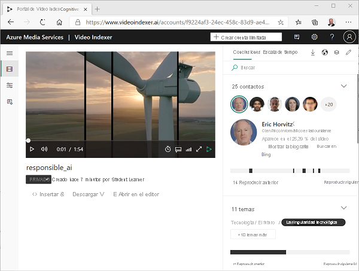
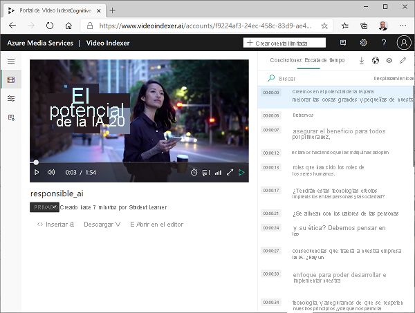
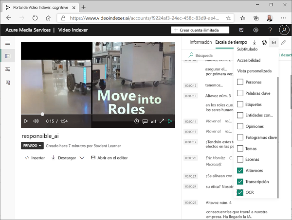
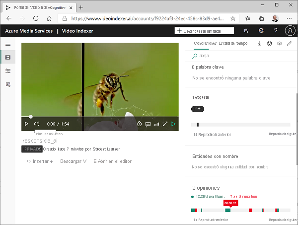
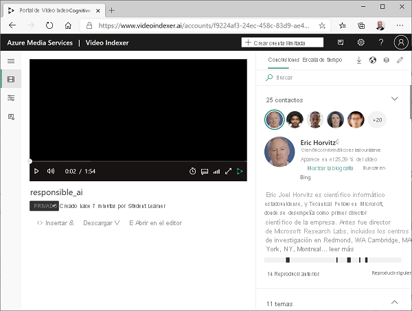
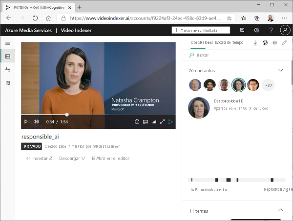
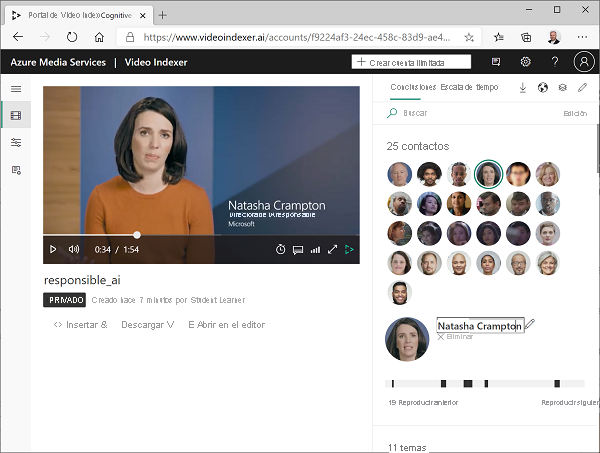
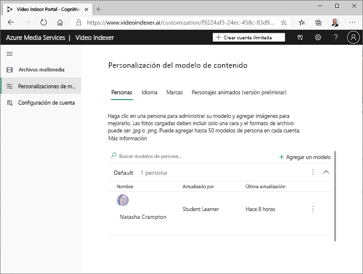
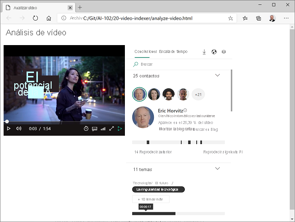

---
lab:
  title: Análisis de vídeo con Video Analyzer
  module: Module 8 - Getting Started with Computer Vision
ms.openlocfilehash: cd67c472b5ee15efce232483afc8aeeac552b50c
ms.sourcegitcommit: d6da3bcb25d1cff0edacd759e75b7608a4694f03
ms.translationtype: HT
ms.contentlocale: es-ES
ms.lasthandoff: 11/16/2021
ms.locfileid: "132625933"
---
# Análisis de vídeo con Video Analyzer

Una gran proporción de los datos creados y consumidos hoy en día tiene el formato de vídeo. **Video Analyzer for Media** es un servicio con tecnología de inteligencia artificial que puede usar para indexar vídeos y extraer información de ellos.

## Clonación del repositorio para este curso

Si ya ha clonado el repositorio de código **AI-102-AIEngineer** en el entorno en el que está trabajando en este laboratorio, ábralo en Visual Studio Code; en caso contrario, siga estos pasos para clonarlo ahora.

1. Inicie Visual Studio Code.
2. Abra la paleta (Mayús + Ctrl + P) y ejecute un comando **Git: Clone** para clonar el repositorio `https://github.com/MicrosoftLearning/AI-102-AIEngineer` en una carpeta local (no importa qué carpeta).
3. Cuando se haya clonado el repositorio, abra la carpeta en Visual Studio Code.
4. Espere mientras se instalan archivos adicionales para admitir los proyectos de código de C# en el repositorio.

    > **Nota**: Si se le pide que agregue los recursos necesarios para compilar y depurar, seleccione **Ahora no**.

## Cargar un vídeo a Video Analyzer

En primer lugar, deberá iniciar sesión en el portal de Video Analyzer y cargar un vídeo.

> **Sugerencia**: Si la página de Video Analyzer tarda en cargarse en el entorno de laboratorio hospedado, use el explorador instalado localmente. Puede volver a la máquina virtual hospedada para las tareas posteriores.

1. En el explorador, abra el portal de Video Analyzer en `https://www.videoindexer.ai`.
2. Si ya tiene una cuenta de Video Analyzer, inicie sesión. De lo contrario, regístrese para obtener una cuenta gratuita e inicie sesión con su cuenta Microsoft (o cualquier otro tipo de cuenta válido). Si tiene dificultades para iniciar sesión, intente abrir una sesión privada del explorador.
3. En Video Analyzer, seleccione la opción **Cargar**. A continuación, seleccione la opción para **escribir una dirección URL de archivo** y escriba `https://aka.ms/responsible-ai-video`. Cambie el nombre predeterminado a **IA responsable**, revise la configuración predeterminada, active la casilla para comprobar el cumplimiento de las directivas de Microsoft para el reconocimiento facial y cargue el archivo.
4. Una vez cargado el archivo, espere unos minutos mientras Video Analyzer lo indexa automáticamente.

> **Nota**: En este ejercicio, vamos a usar este vídeo para explorar la funcionalidad de Video Analyzer; pero debe verlo en su totalidad cuando haya terminado el ejercicio, ya que contiene información útil y una guía para desarrollar aplicaciones habilitadas para la inteligencia artificial de forma responsable. 

## Revisión de la información de vídeo

El proceso de indexación extrae información del vídeo, que puede ver en el portal.

1. En el portal de Video Analyzer, cuando se indexe el vídeo, selecciónelo para verlo. Verá el reproductor de vídeo junto con un panel que muestra la información extraída del vídeo.

2. A medida que se reproduce el vídeo, seleccione la pestaña **Línea de tiempo** para ver una transcripción del audio del vídeo.

3. En la parte superior derecha del portal, seleccione el símbolo **Ver** (que es similar a 🗇) y, en la lista de información, además de **Transcripción**, seleccione **OCR** y **Hablantes**.

4. Fíjese en que el panel **Línea de tiempo** ahora incluye:
    - Transcripción de la narración de audio.
    - Texto visible en el vídeo.
    - Indicaciones de los hablantes que aparecen en el vídeo. Algunas personas conocidas se reconocen automáticamente por el nombre y otras se indican por número (por ejemplo, *Hablante n.º 1*).
5. Vuelva al panel **Información** y vea la información que se muestra allí. Incluyen:
    - Personas concretas que aparecen en el vídeo.
    - Temas tratados en el vídeo.
    - Etiquetas para los objetos que aparecen en el vídeo.
    - Entidades con nombre, como personas y marcas que aparecen en el vídeo.
    - Escenas clave.
6. Con el panel **Información** visible, vuelva a seleccionar el símbolo **Ver** y, en la lista de información, agregue **Palabras clave** y **Opiniones** al panel.

    La información que se encuentre puede ayudarle a determinar los temas principales del vídeo. Por ejemplo, los **temas** de este vídeo muestran que trata claramente de tecnología, responsabilidad social y ética.

## Búsqueda de información

Puede usar Video Analyzer para buscar información en el vídeo.

1. En el panel **Información**, en el cuadro **Buscar**, escriba *Abeja*. Es posible que tenga que desplazarse hacia abajo en el panel Información para ver los resultados de todos los tipos de información.
2. Observe que se encuentra una *etiqueta* coincidente, con su ubicación en el vídeo indicado debajo.
3. Seleccione el principio de la sección en la que se indica la presencia de una abeja y vea el vídeo en ese momento (es posible que tenga que pausarlo y seleccionarlo detenidamente; ¡la abeja solo aparece brevemente!).
4. Desactive el cuadro **Buscar** para mostrar toda la información del vídeo.

## Edición de información

Puede usar Video Analyzer para editar la información que se ha encontrado y agregar información personalizada para que el vídeo tenga aún más sentido.

1. Rebobine el vídeo al principio y vea las **personas** que aparecen en la parte superior del panel **Información**. Observe que se ha reconocido a algunas personas, como **Eric Horwitz**, un científico informático y técnico de Microsoft.

2. Seleccione la foto de Eric Horwitz y vea la información que aparece debajo; para ello, expanda la sección **Show biography** (Mostrar biografía) para ver información sobre esta persona.
3. Observe que se indican las ubicaciones del vídeo donde aparece. Puede usarlas para ver esas secciones del vídeo.
4. En el reproductor de vídeo, busque la persona que habla aproximadamente en el minuto 0:34:

5. Observe que esta persona no se reconoce y se le ha asignado un nombre genérico, como **Desconocido n.º 1**. Sin embargo, el vídeo incluye una leyenda con el nombre de esta persona, por lo que podemos enriquecer la información editando sus detalles.
6. En la parte superior derecha del portal, seleccione el icono **Edición** (&#x1F589;). A continuación, cambie el nombre de la persona desconocida a **Natasha Crampton**.

7. Una vez que haya realizado el cambio de nombre, busque *Natasha* en el panel **Información**. Los resultados deberían incluir una persona e indicar las secciones del vídeo en las que aparecen.
8. En la parte superior izquierda del portal, expanda el menú (≡) y seleccione la página **Personalizaciones del modelo**. A continuación, en la pestaña **Personas**, observe que el modelo de personas **Predeterminadas** tiene una persona en él. Video Analyzer ha agregado la persona a la que le ha puesto un nombre al modelo de personas, de modo que se reconocerá en los vídeos futuros que indexe en su cuenta.

Puede agregar imágenes de personas al modelo de personas predeterminadas o agregar nuevos modelos propios. Esto le permite definir colecciones de personas con imágenes de su cara para que Video Analyzer pueda reconocerlas en los vídeos.

Observe también que también puede crear modelos personalizados para el lenguaje (por ejemplo, para especificar terminología específica del sector que quiera que Video Analyzer reconozca) y marcas (por ejemplo, nombres de empresa o producto).

## Uso de widgets de Video Analyzer

El portal de Video Analyzer es una interfaz útil para administrar proyectos de indexación de vídeo. Sin embargo, puede haber ocasiones en las que quiera que el vídeo y su información estén disponibles para las personas que no tienen acceso a su cuenta de Video Analyzer. Video Analyzer proporciona widgets que puede insertar en una página web para este propósito.

1. En Visual Studio Code, en la carpeta **16-video-indexer**, abra **analyze-video.html**. Se trata de una página HTML básica en la que agregará los widgets de **Reproductor** e **Información** de Video Analyzer. Fíjese en la referencia al script **vb.widgets.mediator.js** en el encabezado: este script permite que varios widgets de Video Analyzer de la página interactúen entre sí.
2. En el portal de Video Analyzer, vuelva a la página **Archivos multimedia** y abra el vídeo **IA responsable**.
3. En el reproductor de vídeo, seleccione **&lt;/&gt; Insertar** para ver el código iframe HTML para insertar los widgets.
4. En el cuadro de diálogo **Compartir e insertar**, seleccione el widget **Reproductor**, establezca el tamaño del vídeo en 560 x 315 y, a continuación, copie el código para insertar en el portapapeles.
5. En Visual Studio Code, en el archivo **analyze-video.html**, pegue el código copiado en el comentario **&lt;-- El widget Reproductor va aquí -- &gt;** .
6. En el cuadro de diálogo **Compartir e insertar**, seleccione el widget **Información** y, a continuación, copie el código para insertar en el portapapeles. A continuación, cierre el cuadro de diálogo **Compartir e insertar**, vuelva a Visual Studio Code y pegue el código copiado en el comentario **&lt;-- El widget Información va aquí -- &gt;** .
7. Guarde el archivo. A continuación, en el panel **Explorador**, haga clic con el botón derecho en **analyze-video.html** y seleccione **Mostrar en el Explorador de archivos**.
8. En el Explorador de archivos, abra **analyze-video.html** en el explorador para ver la página web.
9. Experimente con los widgets, usando el widget **Información** para buscar información y saltar a ella en el vídeo.

## Uso de la API de REST de Video Analyzer

Video Analyzer proporciona una API de REST que puede usar para cargar y administrar vídeos en su cuenta.

### Obtener los detalles de la API

Para usar la API de Video Analyzer, necesita cierta información para autenticar las solicitudes:

1. En el portal de Video Analyzer, expanda el menú (≡) y seleccione la página **Configuración de la cuenta**.
2. Anote el **identificador de cuenta** en esta página; lo necesitará más adelante.
3. Abra una nueva pestaña del explorador y vaya al portal para desarrolladores de Video Analyzer en `https://api-portal.videoindexer.ai`, iniciando sesión con las credenciales de su cuenta de Video Analyzer.
4. En la página **Perfil**, vea las **Suscripciones** asociadas a su perfil.
5. En la página con sus suscripciones, observe que se le han asignado dos claves (una principal y una secundaria) para cada suscripción. A continuación, seleccione **Mostrar** en cualquiera de las claves para verla. Necesitará esta clave en breve.

### Uso de la API de REST

Ahora que tiene el identificador de cuenta y una clave de API, puede usar la API de REST para trabajar con vídeos en su cuenta. En este procedimiento, usará un script de PowerShell para realizar llamadas REST, pero se aplican los mismos principios con utilidades HTTP, como cURL o Postman, o cualquier lenguaje de programación capaz de enviar y recibir JSON a través de HTTP.

Todas las interacciones con la API de REST de Video Analyzer siguen el mismo patrón:

- Se usa una solicitud inicial al método **AccessToken** con la clave de API en el encabezado para obtener un token de acceso.
- Las solicitudes posteriores usan el token de acceso para autenticarse al llamar a métodos REST para trabajar con vídeos.

1. En Visual Studio Code, en la carpeta **16-video-indexer**, abra **get-videos.ps1**.
2. En el script de PowerShell, reemplace los marcadores de posición **YOUR_ACCOUNT_ID** y **YOUR_API_KEY** por los valores de identificador de cuenta y clave de API que identificó anteriormente.
3. Observe que la *ubicación* de una cuenta gratuita es "trial". Si ha creado una cuenta de Video Analyzer sin restricciones (con un recurso de Azure asociado), puede cambiarla a la ubicación donde se aprovisiona el recurso de Azure (por ejemplo, "eastus").
4. Revise el código del script, y tenga en cuenta que invoca dos métodos REST: uno para obtener un token de acceso y otro para enumerar los vídeos de su cuenta.
5. Guarde los cambios y, a continuación, en la parte superior derecha del panel de scripts, use el botón **▷** para ejecutar el script.
6. Vea la respuesta JSON del servicio REST, que debe contener detalles del vídeo **IA responsable** que indexó anteriormente.

## Más información

Para obtener más información acerca de **Video Analyzer**, consulte la [documentación de Video Analyzer](https://docs.microsoft.com/azure/azure-video-analyzer/video-analyzer-for-media-docs/).
