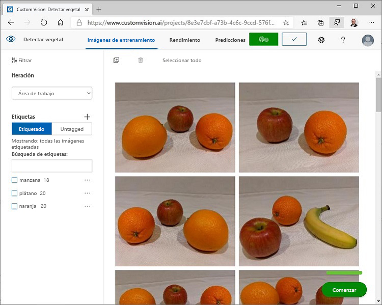

---
lab:
  title: Detección de objetos en imágenes con Custom Vision
  module: Module 9 - Developing Custom Vision Solutions
ms.openlocfilehash: a45f5d06f7abace5ad4472c93dc9de360ca2718a
ms.sourcegitcommit: d6da3bcb25d1cff0edacd759e75b7608a4694f03
ms.translationtype: HT
ms.contentlocale: es-ES
ms.lasthandoff: 11/16/2021
ms.locfileid: "132625924"
---
# <a name="detect-objects-in-images-with-custom-vision"></a>Detección de objetos en imágenes con Custom Vision

En este ejercicio, usará el servicio Custom Vision para entrenar un modelo de *detección de objetos* que pueda detectar y localizar tres tipos de fruta (manzana, plátano y naranja) en una imagen.

## <a name="clone-the-repository-for-this-course"></a>Clonación del repositorio para este curso

Si ya ha clonado el repositorio de código **AI-102-AIEngineer** en el entorno en el que está trabajando en este laboratorio, ábralo en Visual Studio Code; en caso contrario, siga estos pasos para clonarlo ahora.

1. Inicie Visual Studio Code.
2. Abra la paleta (Mayús+Ctrl+P) y ejecute un comando **Git: Clone** para clonar el repositorio `https://github.com/MicrosoftLearning/AI-102-AIEngineer` en una carpeta local (no importa qué carpeta).
3. Cuando se haya clonado el repositorio, abra la carpeta en Visual Studio Code.
4. Espere mientras se instalan archivos adicionales para admitir los proyectos de código de C# en el repositorio.

    > **Nota**: Si se le pide que agregue los recursos necesarios para compilar y depurar, seleccione **Ahora no**.

## <a name="create-custom-vision-resources"></a>Creación de recursos de Custom Vision

Si ya tiene recursos de entrenamiento y predicción de **Custom Vision** en su suscripción de Azure, puede usarlos en este ejercicio. En caso contrario, siga estas instrucciones para crearlos.

1. En una nueva pestaña del explorador, abra Azure Portal en `https://portal.azure.com` e inicie sesión con la cuenta de Microsoft asociada a su suscripción de Azure.
2. Seleccione el botón **&#65291;Crear un recurso**, busque *Custom Vision* y cree un recurso de **Custom Vision** con la siguiente configuración:
    - **Opciones de creación**: ambas
    - **Suscripción**: *suscripción de Azure*
    - **Grupo de recursos**: *elija o cree un grupo de recursos (si usa una suscripción restringida, es posible que no tenga permiso para crear un nuevo grupo de recursos; use el proporcionado)*
    - **Nombre**: *escriba un nombre único*
    - **Ubicación del entrenamiento**: *elija cualquier región disponible*
    - **Plan de tarifa de entrenamiento**: F0
    - **Ubicación de la predicción**: *la misma región del recurso de entrenamiento*
    - **Plan de tarifa de predicción**: F0

    > **Nota**: Si ya tiene un servicio Custom Vision F0 en su suscripción, seleccione **S0** en este caso.

3. Espere a que se creen los recursos, consulte los detalles de la implementación y verá que se aprovisionan dos recursos de Custom Vision, uno para el entrenamiento y otro para la predicción. Para ver estos recursos, vaya al grupo de recursos en el que los creó.

> **Importante**: Cada recurso tiene su propio *punto de conexión* y sus *claves*, que se usan para administrar el acceso desde el código. Para entrenar un modelo de clasificación de imágenes, el código debe usar el recurso de *entrenamiento* (con su punto de conexión y su clave); y para usar el modelo entrenado para predecir clases de imágenes, el código debe usar el recurso de *predicción* (con su punto de conexión y su clave).

## <a name="create-a-custom-vision-project"></a>Creación de un proyecto de Custom Vision

Para entrenar un modelo de detección de objetos, debe crear un proyecto de Custom Vision basado en su recurso de entrenamiento. Para hacerlo, debe usar el portal de Custom Vision.

1. En una nueva pestaña del explorador, abra el portal de Custom Vision en `https://customvision.ai` e inicie sesión con la cuenta de Microsoft asociada a su suscripción de Azure.
2. Cree un nuevo proyecto con la siguiente configuración:
    - **Nombre**: Detect Fruit
    - **Descripción**: detección de objetos de fruta
    - **Recurso**: *el recurso de Custom Vision que ha creado anteriormente*
    - **Tipos de proyecto**: detección de objetos
    - **Dominios**: General
3. Espere a que se cree el proyecto y se abra en el navegador.

## <a name="add-and-tag-images"></a>Agregar y etiquetar imágenes

Para entrenar un modelo de detección de objetos, debe cargar imágenes que contengan las clases el modelo tendrá que identificar y etiquetarlas para indicar los cuadros de límite de cada instancia de objeto.

1. En Visual Studio Code, consulte las imágenes de entrenamiento en la carpeta **18-object-detection/training-images** donde clonó el repositorio. Esta carpeta contiene imágenes de fruta.
2. En el portal de Custom Vision, en el proyecto de detección de objetos, seleccione **Add images** y cargue todas las imágenes de la carpeta extraída.
3. Una vez cargadas las imágenes, seleccione la primera para abrirla.
4. Pase el cursor sobre cualquier objeto de la imagen hasta que aparezca una región detectada automáticamente, tal y como aparece en la imagen siguiente. Después, seleccione el objeto y, si es necesario, cambie el tamaño de la región para rodearlo.


De forma alternativa, puede arrastrar el cursor alrededor del objeto para crear una región.

5. Cuando la región rodee el objeto, agregue una nueva etiqueta con el tipo de objeto adecuado (*apple*, *banana* u *orange*), tal y como aparece aquí:


6. Seleccione y etiquete cada objeto de la imagen, modifique el tamaño de las regiones y agregue nuevas etiquetas si es necesario.


7. Use el vínculo **>** de la derecha para pasar a la siguiente imagen y etiquetar sus objetos. Haga lo mismo con el resto de imágenes, etiquete cada manzana, banana y naranja.

8. Cuando haya terminado de etiquetar la última imagen, cierre el editor **Image Detail** y, en la página **Training Images**, en **Tags**, seleccione **Tagged** para ver todas las imágenes etiquetadas:



## <a name="use-the-training-api-to-upload-images"></a>Uso de la API de entrenamiento para cargar imágenes

Puede usar la herramienta gráfica en el portal de Custom Vision para etiquetar las imágenes, pero muchos equipos de desarrollo de IA usan otras herramientas que generan archivos con información sobre regiones de objetos y etiquetas de imágenes. En escenarios como este, puede usar la API de entrenamiento de Custom Vision para cargar imágenes etiquetadas en el proyecto.

> **Nota**: En este ejercicio, puede elegir usar la API del SDK de **C#** o **Python**. En los pasos siguientes, realice las acciones adecuadas para su lenguaje preferido.

1. Haga clic en el icono de *configuración* (&#9881;) situado en la parte superior derecha de la página **Imágenes de entrenamiento** del portal de Custom Vision para ver la configuración del proyecto.
2. En **General** (a la izquierda), fíjese en el **Id. de proyecto** que identifica de forma única este proyecto.
3. A la derecha, en **Recursos**, fíjese en que se muestran los detalles del recurso de *entrenamiento*, incluido su punto de conexión y su clave (también puede consultar el recurso en Azure Portal para obtener esta información).
4. En Visual Studio Code, en la carpeta **18-object-detection**, expanda la carpeta **C-Sharp** o **Python** según sus preferencias de lenguaje.
5. Haga clic con el botón derecho en la carpeta **train-detector** y abra un terminal integrado. A continuación, instale el paquete de entrenamiento de Custom Vision mediante la ejecución del comando adecuado para sus preferencias de lenguaje:

**C#**

```
dotnet add package Microsoft.Azure.CognitiveServices.Vision.CustomVision.Training --version 2.0.0
```

**Python**

```
pip install azure-cognitiveservices-vision-customvision==3.1.0
```

6. Consulte el contenido de la carpeta **train-detector** y fíjese en que contiene un archivo para los valores de configuración:
    - **C#** : appsettings.json
    - **Python**: .env

    Abra el archivo de configuración y actualice los valores de configuración que contiene para reflejar el punto de conexión y la clave del recurso de *entrenamiento* de Custom Vision, así como el id. del proyecto de clasificación que creó anteriormente. Guarde los cambios.

7. En la carpeta **train-detector**, abra **tagged-images.json** y examine el JSON que contiene. El código JSON define una lista de imágenes, que contienen una o varias regiones etiquetadas. Cada región etiquetada incluye un nombre de etiqueta y las coordenadas superior e izquierda y las dimensiones de ancho y altura del cuadro de límite que contiene el objeto etiquetado.

    > **Nota**: Las coordenadas y dimensiones de este archivo indican puntos relativos en la imagen. Por ejemplo, un valor de *altura* de 0,7 hace referencia a un cuadro que es el 70 % del alto de la imagen. Algunas herramientas de etiquetado generan otros formatos de archivo en los que los valores de coordenadas y dimensiones representan píxeles, pulgadas u otras unidades de medida.

8. Tenga en cuenta que la carpeta **train-detector** contiene una subcarpeta en la que se almacenan los archivos de imagen a los que se hace referencia en el archivo JSON.


9. Tenga en cuenta que la carpeta **train-detector** contiene un archivo de código para la aplicación cliente:

    - **C#** : Program.cs
    - **Python**: train-detector.py

    Abra el archivo de código y revise el código que contiene, fijándose en los siguientes detalles:
    - Se importan los espacios de nombres del paquete instalado.
    - La función **Main** recupera los valores de configuración y usa la clave y el punto de conexión para crear una clase **CustomVisionTrainingClient** autenticada, que luego se usa con el id. del proyecto para crear una referencia de **proyecto** al proyecto.
    - La función **Upload_Images** extrae la información de la región etiquetada del archivo JSON y la usa para crear un lote de imágenes con regiones, que luego carga en el proyecto.
10. Vuelva al terminal integrado de la carpeta **train-detector** y escriba el siguiente comando para ejecutar el programa:
    
**C#**

```
dotnet run
```

**Python**

```
python train-detector.py
```
    
11. Espere a que el programa finalice. A continuación, vuelva al explorador y consulte la página **Imágenes de entrenamiento** del proyecto en el portal de Custom Vision (actualice el explorador si es necesario).
12. Compruebe que se han agregado al proyecto algunas imágenes etiquetadas nuevas.

## <a name="train-and-test-a-model"></a>Entrenar y probar un modelo

Ahora que hemos etiquetado las imágenes del proyecto, es hora de entrenar un modelo.

1. En el proyecto de Custom Vision, haga clic en **Train** para entrenar un modelo de detección de objetos con las imágenes etiquetadas. Seleccione la opción **Quick Training**.
2. Espere a que se complete el entrenamiento (puede tardar alrededor de 10 minutos) y compruebe las métricas de rendimiento *Precision*, *Recall* y *mAP* (miden la precisión de la predicción del modelo de clasificación y sus valores deberían ser altos).
3. En la esquina superior derecha de la página, haga clic en **Prueba rápida** y, después, en el cuadro **Dirección URL de imagen**, escriba `https://aka.ms/apple-orange` y vea la predicción que se genera. Después, cierre la ventana **Quick Test**.

## <a name="publish-the-object-detection-model"></a>Publicación del modelo de detección de objetos

Ya puede publicar su modelo entrenado para poder usarlo desde una aplicación cliente.

1. En el portal de Custom Vision, en la página **Rendimiento**, haga clic en **&#128504; Publicar** para publicar el modelo entrenado con la siguiente configuración:
    - **Nombre del modelo**: fruit-detector
    - **Recurso de predicción**: *el recurso de **predicción** creado anteriormente (<u>no</u> el recurso de entrenamiento)* .
2. En la parte superior izquierda de la página **Configuración del proyecto**, haga clic en el icono *Projects Gallery* (Galería de proyectos) (&#128065;) para volver a la página principal del portal de Custom Vision, donde debería aparecer su proyecto.
3. En la página principal del portal de Custom Vision, en la esquina superior derecha, haga clic en el icono de *configuración* (&#9881;) para ver la configuración de su servicio Custom Vision. A continuación, en **Recursos**, busque el recurso de *predicción* (<u>no</u> el recurso de entrenamiento) para determinar sus valores de **Clave** y **Punto de conexión** (también puede consultar el recurso en Azure Portal para obtener esta información).

## <a name="use-the-image-classifier-from-a-client-application"></a>Uso del clasificador de imágenes desde una aplicación cliente

Ahora que ha publicado el modelo de clasificación de imágenes, puede usarlo desde una aplicación cliente. Una vez más, puede optar por usar **C#** o **Python**.

1. En Visual Studio Code, vaya a la carpeta **18-object-detection** y, en la carpeta de su lenguaje preferido (**C-Sharp** o **Python**), expanda la carpeta **test-detector**.
2. Haga clic con el botón derecho en la carpeta **test-detector** y abra un terminal integrado. A continuación, escriba el siguiente comando específico del SDK para instalar el paquete de predicción de Custom Vision:

**C#**

```
dotnet add package Microsoft.Azure.CognitiveServices.Vision.CustomVision.Prediction --version 2.0.0
```

**Python**

```
pip install azure-cognitiveservices-vision-customvision==3.1.0
```

> **Nota**: El paquete del SDK de Python incluye paquetes de entrenamiento y predicción, y es posible que ya esté instalado.

3. Abra el archivo de configuración de la aplicación cliente (*appsettings.json* para C# o *.env* para Python) y actualice los valores de configuración que contiene para reflejar el punto de conexión y la clave del recurso de *predicción* de Custom Vision, el id. del proyecto de detección de objetos y el nombre del modelo publicado (que debe ser *fruit-detector*). Guarde los cambios.
4. Abra el archivo de código de la aplicación cliente (*Program.cs* para C#, *test-detector.py* para Python) y revise el código que contiene, fijándose en los detalles siguientes:
    - Se importan los espacios de nombres del paquete instalado.
    - La función **Main** recupera los valores de configuración y usa la clave y el punto de conexión para crear una clase **CustomVisionPredictionClient** autenticada.
    - El objeto de cliente de predicción se usa para obtener predicciones de detección de objetos de la imagen **produce.jpg**; para ello, se debe especificar el id. del proyecto y el nombre del modelo en la solicitud. A continuación, las regiones etiquetadas que se han predicho se dibujan en la imagen y el resultado se guarda como **output.jpg**.
5. Vuelva al terminal integrado de la carpeta **test-detector** y escriba el siguiente comando para ejecutar el programa:

**C#**

```
dotnet run
```

**Python**

```
python test-detector.py
```

6. Una vez completado el programa, consulte el archivo **output.jpg** resultante para ver los objetos detectados en la imagen.

## <a name="more-information"></a>Más información

Para obtener más información sobre la detección de objetos con el servicio Custom Vision, consulte la [documentación de Custom Vision](https://docs.microsoft.com/azure/cognitive-services/custom-vision-service/).
