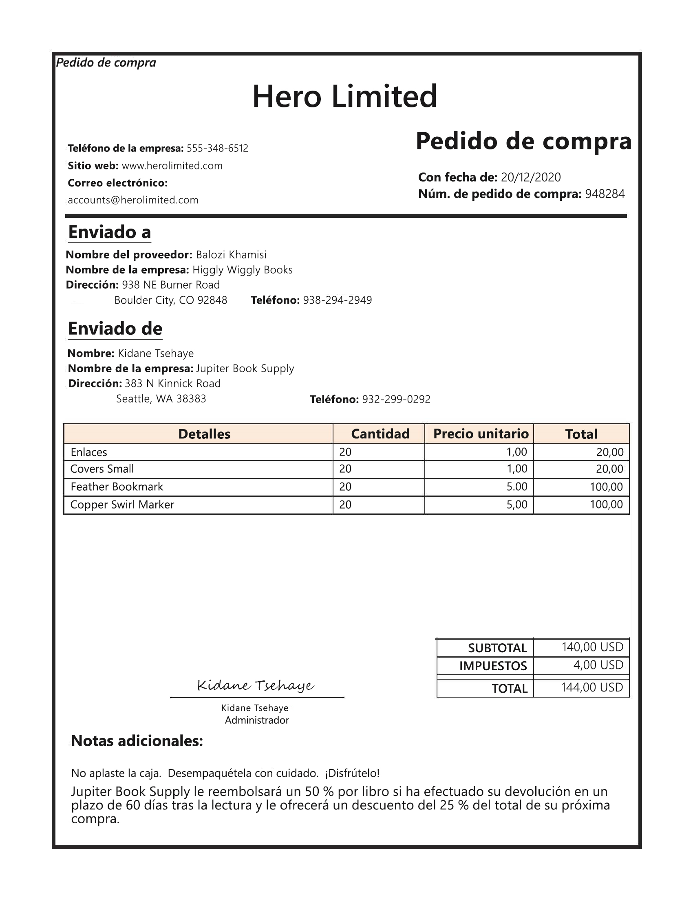
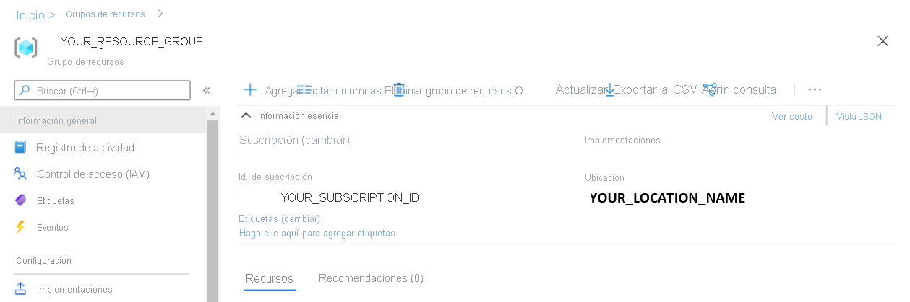

---
lab:
  title: Extracción de datos de formularios
  module: Module 11 - Reading Text in Images and Documents
ms.openlocfilehash: 3439c9d2d53fd0461b2fe35b095ea86d5ed3abaa
ms.sourcegitcommit: da2617566698e889ff53426e6ddb58f42ccf9504
ms.translationtype: HT
ms.contentlocale: es-ES
ms.lasthandoff: 05/05/2022
ms.locfileid: "144776177"
---
# <a name="extract-data-from-forms"></a>Extracción de datos de formularios 

Imagine que, en una empresa, los empleados actualmente deben comprar manualmente hojas de pedidos y escribir los datos en una base de datos. Les gustaría usar servicios de inteligencia artificial para mejorar el proceso de entrada de datos. Usted decide crear un modelo de aprendizaje automático que lea el formulario y genere datos estructurados que se puedan usar para actualizar automáticamente una base de datos.

**Form Recognizer** es un servicio cognitivo que permite a los usuarios compilar software de procesamiento de datos automatizado. Este software puede extraer texto, pares clave-valor y tablas de documentos de formulario mediante el reconocimiento óptico de caracteres (OCR). Form Recognizer dispone de modelos creados previamente para reconocer facturas, recibos y tarjetas de presentación. El servicio también proporciona la capacidad de entrenar modelos personalizados. En este ejercicio, nos centraremos en la creación de modelos personalizados.

## <a name="clone-the-repository-for-this-course"></a>Clonación del repositorio para este curso

Si aún no lo ha hecho, debe clonar el repositorio de código para este curso:

1. Inicie Visual Studio Code.
2. Abra la paleta (Mayús + Ctrl + P) y ejecute un comando **Git: Clone** para clonar el repositorio `https://github.com/MicrosoftLearning/AI-102-AIEngineer` en una carpeta local (no importa qué carpeta).
3. Cuando se haya clonado el repositorio, abra la carpeta en Visual Studio Code.
4. Espere mientras se instalan archivos adicionales para admitir los proyectos de código de C# en el repositorio.

    > **Nota**: Si se le pide que agregue los recursos necesarios para compilar y depurar, seleccione **Ahora no**.

## <a name="create-a-form-recognizer-resource"></a>Creación de un recurso de Form Recognizer

Para usar el servicio Form Recognizer, debe crear un recurso de Form Recognizer o Cognitive Services en su suscripción de Azure. Usará Azure Portal para crear un recurso.

1.  Inicie sesión en Azure Portal en `https://portal.azure.com` y regístrese con la cuenta de Microsoft asociada a su suscripción de Azure.

2. Seleccione el botón **+Crear un recurso**, busque *Form Recognizer* y cree un recurso de **Form Recognizer** con esta configuración:
    - **Suscripción**: *suscripción de Azure*
    - **Grupo de recursos**: *elija o cree un grupo de recursos (si usa una suscripción restringida, es posible que no tenga permiso para crear un nuevo grupo de recursos; use el proporcionado)*
    - **Región**: *elija cualquier región disponible*
    - **Nombre**: *escriba un nombre único*
    - **Plan de tarifa**: F0.

    > **Nota**: Si ya tiene un servicio Form Recognizer F0 en su suscripción, seleccione **S0** en este caso.

3. Cuando se haya implementado el recurso, vaya a él y vea su página **Keys and Endpoint** (Claves y punto de conexión). Necesitará el **punto de conexión** y una de las **claves** de esta página para administrar el acceso desde el código más tarde. 

## <a name="gather-documents-for-training"></a>Recopilación de documentos para el entrenamiento

  

Usará los formularios de ejemplo de la carpeta **21-custom-form/sample-forms** de este repositorio, que contienen todos los archivos que necesitará para entrenar y probar un modelo.

1. En Visual Studio Code, en la carpeta **21-custom-form**, expanda la carpeta **sample-forms**. Observe que hay archivos que terminan en **.json** y **.jpg** en la carpeta.

    Usará los archivos **.jpg** para entrenar el modelo.  

    Los archivos **.json** se han generado automáticamente y contienen información de etiqueta. Los archivos se cargarán en el contenedor de Blob Storage junto con los formularios. 

2. Vuelva a Azure Portal en [https://portal.azure.com](https://portal.azure.com).

3. Vea el **Grupo de recursos** en el que ha creado el recurso de Form Recognizer previamente.

4. En la página **Información general** del grupo de recursos, tome nota de los valores de **Id. de suscripción** y **Ubicación**. Los necesitará, junto con el nombre del **grupo de recursos**, en los pasos posteriores.



5. En Visual Studio Code, en el panel Explorador, haga clic con el botón derecho en la carpeta **21-custom-form** y seleccione **Open in Integrated Terminal** (Abrir en terminal integrado).

6. En el panel de terminal, escriba el siguiente comando para establecer una conexión autenticada con su suscripción de Azure.
    
```
az login --output none
```

7. Cuando se le solicite, inicie sesión en su suscripción de Azure. Después, vuelva a Visual Studio Code y espere a que se complete el proceso de inicio de sesión.

8. Ejecute el siguiente comando para enumerar las ubicaciones de Azure.

```
az account list-locations -o table
```

9. En la salida, busque el valor de **Nombre** que corresponde a la ubicación del grupo de recursos (por ejemplo, para *Este de EE. UU.* , el nombre correspondiente es *eastus*).

    > **Importante**: Anote el valor de **Nombre** y úselo en el paso 12.

10. En el panel Explorador, en la carpeta **21-custom-form**, seleccione **setup.cmd**. Usará este script por lotes para ejecutar los comandos de la interfaz de la línea de comandos (CLI) de Azure necesarios para crear los demás recursos de Azure que necesita.

11. En el script **setup.cmd**, revise los comandos **rem**. Estos comentarios describen el programa que ejecutará el script. El programa: 
    - Creará una cuenta de almacenamiento en el grupo de recursos de Azure.
    - Cargará archivos de la carpeta local _sampleforms_ a un contenedor denominado _sampleforms_ en la cuenta de almacenamiento
    - Imprimirá un URI de firma de acceso compartido

12. Modificará las declaraciones de las variables **subscription_id**, **resource_group** y **location** con los valores adecuados para la suscripción, el grupo de recursos y el nombre de ubicación donde implementó el recurso de Form Recognizer. Después, **guarde** los cambios.

    Deje la variable **expiry_date** tal y como está para el ejercicio. Esta variable se usa al generar el URI de firma de acceso compartido (SAS). En la práctica, establecerá una fecha de expiración adecuada para la SAS. Puede obtener más información sobre SAS [aquí](https://docs.microsoft.com/azure/storage/common/storage-sas-overview#how-a-shared-access-signature-works).  

13. En el terminal de la carpeta **21-custom-search**, escriba el siguiente comando para ejecutar el script:

```
setup
```

14. Cuando se complete el script, revise la salida mostrada y anote el URI de SAS del recurso de Azure.

> **Importante**: Antes de seguir, pegue el URI de SAS en algún lugar donde pueda recuperarlo más adelante (por ejemplo, en un nuevo archivo de texto en Visual Studio Code).

15. En Azure Portal, actualice el grupo de recursos y compruebe que contiene la cuenta de Azure Storage que acaba de crear. Abra la cuenta de almacenamiento y, en el panel de la izquierda, seleccione **Explorador de almacenamiento (versión preliminar)** . A continuación, en el Explorador de almacenamiento, expanda **CONTENEDORES DE BLOBS** y seleccione el contenedor **sampleforms** para comprobar que los archivos se hayan cargado desde la carpeta local **21-custom-form/sample-forms**.

## <a name="train-a-model-using-the-form-recognizer-sdk"></a>Entrenamiento de un modelo con el SDK de Form Recognizer

Ahora entrenará un modelo con los archivos **.jpg** y **.json**.

1. En Visual Studio Code, en la carpeta **21-custom-form/sample-forms**, abra **fields.json** y revise el documento JSON que contiene. Este archivo define los campos que entrenará un modelo para extraer de los formularios.
2. Abra **Form_1.jpg.labels.json** y revise el JSON que contiene. Este archivo identifica la ubicación y los valores de los campos con nombre del documento de entrenamiento **Form_1.jpg**.
3. Abra **Form_1.jpg.ocr.json** y revise el JSON que contiene. Este archivo contiene una representación JSON del diseño de texto de **Form_1.jpg**, incluida la ubicación de todas las áreas de texto que se encuentran en el formulario.

    *En este ejercicio, se proporcionan los archivos con la información de los campos. Para sus propios proyectos, puede crear estos archivos con [Form Recognizer Studio](https://formrecognizer.appliedai.azure.com/studio). A medida que usa la herramienta, se crean automáticamente los archivos de información de los campos y se almacenan en su cuenta de almacenamiento conectada.*

4. En Visual Studio Code, en la carpeta **21-custom-form**, expanda la carpeta **C-Sharp** o **Python** según sus preferencias de lenguaje.
5. Haga clic con el botón derecho en la carpeta **train-model** y abra un terminal integrado.

6. Instale el paquete de Form Recognizer mediante la ejecución del comando adecuado para sus preferencias de lenguaje:

**C#**

```
dotnet add package Azure.AI.FormRecognizer --version 3.0.0 
```

**Python**

```
pip install azure-ai-formrecognizer==3.0.0
```

7. Consulte el contenido de la carpeta **train-model** y observe que contiene un archivo para las opciones de configuración:
    - **C#** : appsettings.json
    - **Python**: .env

8. Edite el archivo de configuración y modifique la configuración para reflejar:
    - El **punto de conexión** del recurso de Form Recognizer.
    - Una **clave** para el recurso de Form Recognizer.
    - El **URI de SAS** del contenedor de blobs.

9. Tenga en cuenta que la carpeta **train-model** contiene un archivo de código para la aplicación cliente:

    - **C#** : Program.cs
    - **Python**: train-model.py

    Abra el archivo de código y revise el código que contiene, fijándose en los siguientes detalles:
    - Se importan los espacios de nombres del paquete instalado.
    - La función **Main** recupera los valores de configuración y usa la clave y el punto de conexión para crear un **Cliente** autenticado.
    - El código usa el cliente de entrenamiento para entrenar un modelo usando las imágenes de su contenedor de Blob Storage, al que se accede con el URI de SAS generado.

10. En la carpeta **train-model**, abra el archivo de código para la aplicación de entrenamiento:

    - **C#** : Program.cs
    - **Python**: train-model.py

11. Vuelva al terminal integrado de la carpeta **train-model** y escriba el siguiente comando para ejecutar el programa:

**C#**

```
dotnet run
```

**Python**

```
python train-model.py
```

12. Espere a que termine el programa y, a continuación, revise la salida del modelo.
13. Anote el id. de modelo de la salida del terminal. Lo necesitará para la siguiente parte del laboratorio. 

## <a name="test-your-custom-form-recognizer-model"></a>Prueba del modelo de Form Recognizer personalizado 

1. En la carpeta **21-custom-form**, en la subcarpeta de su lenguaje preferido (**C-Sharp** o **Python**), expanda la carpeta **test-model**.

2. Haga clic con el botón derecho en la carpeta **test-model** y **abra un terminal integrado**.

3. En el terminal de la carpeta **test-model**, instale el paquete de Form Recognizer mediante la ejecución del comando adecuado para sus preferencias de lenguaje:

**C#**

```
dotnet add package Azure.AI.FormRecognizer --version 3.0.0 
```

**Python**

```
pip install azure-ai-formrecognizer==3.0.0
```

*No es estrictamente necesario si anteriormente usó pip para instalar el paquete en el entorno de Python; pero no hará daño asegurarse de que está instalado.*

4. En la carpeta **test-model**, edite el archivo de configuración (**appsettings.json** o **.env**, según sus preferencias de lenguaje) para agregar los valores siguientes:
    - El punto de conexión de Form Recognizer.
    - La clave de Form Recognizer.
    - El id. de modelo generado al entrenar el modelo (puede encontrarlo cambiando el terminal de nuevo a la consola **cmd** de la carpeta **train-model**). Guarde los cambios mediante **Guardar**.

5. En la carpeta **test-model** abra el archivo de código de la aplicación cliente (*Program.cs* para C#, *test-model.py* para Python) y revise el código que contiene, fijándose en los detalles siguientes:
    - Se importan los espacios de nombres del paquete instalado.
    - La función **Main** recupera los valores de configuración y usa la clave y el punto de conexión para crear un **Cliente** autenticado.
    - A continuación, el cliente se usa para extraer los campos de formulario y los valores de la imagen **test1.jpg**.
    

6. Vuelva al terminal integrado de la carpeta **test-model** y escriba el siguiente comando para ejecutar el programa:

**C#**

```
dotnet run
```

**Python**

```
python test-model.py
```
    
7. Observe que la salida del modelo proporciona nombres de campo como "CompanyPhoneNumber" y "DatedAs".   

## <a name="more-information"></a>Más información

Para obtener más información sobre el servicio Form Recognizer, consulte la [documentación del servicio Form Recognizer](https://docs.microsoft.com/azure/cognitive-services/form-recognizer/).
